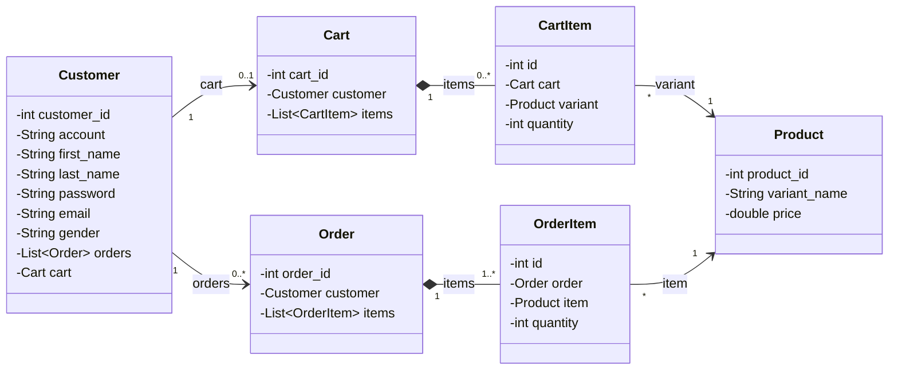

# Shoppee

**Công nghệ:** JSP/JSTL · Jakarta Servlet · JPA (`emailListPU`) · PostgreSQL (Neon) · Brevo API (gửi mail) · Deploy trên Render

## Cấu trúc

```
murach
├── controller  HomeServlet, LoginServlet, LogoutServlet, RegisterServlet,
│               CartServlet, CheckoutServlet, OrderHistoryServlet, MailUtilGmail
├── business    Customer, Product, Cart, CartItem, Order, OrderItem   (Entity)
└── dibu        DBUtil, CustomerDB, ProductDB, CartDB, OrderDB        (DAO)
```

## Class diagram (package `business`)



## Luồng chức năng

| Chức năng | Luồng & phương thức chính |
|---|---|
| Trang chủ | `HomeServlet` → `ProductDB.getAllProducts()` → `home.jsp` |
| Đăng ký | `RegisterServlet` → `CustomerDB.getCustomerByAccount()` (kiểm tra trùng) → `insertCustomer()` → `MailUtilGmail.sendMail()` → `login.jsp` |
| Đăng nhập | `LoginServlet` → `CustomerDB.login()` → lưu `customer` vào session → redirect `HomeServlet` |
| Đăng xuất | `LogoutServlet`: `session.invalidate()` → về trang chủ |
| Giỏ hàng | `CartServlet` (`action` = add / update / remove) → `CartDB.getCart()` (tự tạo giỏ nếu chưa có), `addOrUpdateItem()`, `updateQuantity()` (qty ≤ 0 thì xóa), `removeItem()` → `cus_cart.jsp` |
| Thanh toán | `CheckoutServlet` → `OrderDB.checkout()` → gửi mail xác nhận → `thank.jsp` |
| Lịch sử | `OrderHistoryServlet` → `OrderDB.getOrdersByCustomer()` → `orderhistory.jsp` |


## Cấu hình (biến môi trường trên Render / file `.env`)

`DB_URL`, `DB_USER`, `DB_PASSWORD` (Neon) · `BREVO_API_KEY`, `MAIL_SEND` (gửi mail)

`DBUtil` tự nạp các biến này và để JPA tự tạo bảng (`schema-generation = create`).


